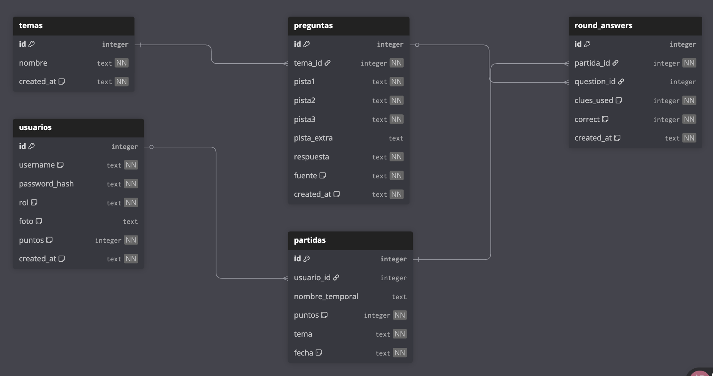

# CLICKA — Juego de pistas

CLICKA es una aplicación web de preguntas por pistas.  
El jugador elige una temática, responde **5 preguntas** por partida y suma **más puntos** cuanto antes acierta (con menos pistas reveladas).

## Funcionalidades principales

- **Juego por categorías** cargadas en SQLite (`pages/play.php`): pistas progresivas y validación en servidor (`api/validate.php`).
- **Temática especial Banderas del Mundo** (`pages/banderes.php`): datos de países vía API pública REST Countries (requiere red). Detalle en [APIs externas utilizadas](#apis-externas-utilizadas).
- **Perfil de usuario** (`pages/profile.php`): avatares opcionales mediante URLs generadas con la API pública **DiceBear** (SVG). Detalle en la misma sección.
- **Ranking**: vista global (suma de puntos en todas las categorías para usuarios registrados) y filtros por temática (`pages/ranking.php`).
- **Registro e inicio de sesión**: el acceso usa **correo electrónico** y contraseña; en ranking y comunidad se muestra el **nombre de usuario público** (`nombre_usuario`, único, 3–20 caracteres).
- **Comunidad**: opiniones y comentarios recientes (`pages/opiniones.php`).
- **Administración** (rol admin): usuarios, temas, preguntas (alta manual o borrador con IA), moderación de feedback.
- **IA opcional** (Anthropic): generación de pistas desde el panel de preguntas (`api/ai_question.php`, requiere `ANTHROPIC_API_KEY`).

## APIs externas utilizadas

- **REST Countries**: el cliente (JavaScript en `assets/js/banderes.js`) solicita datos de países y banderas en formato JSON sobre HTTPS. Se usa en **Banderas del Mundo** (`pages/banderes.php`). Requiere red en el navegador.

- **DiceBear** (`https://api.dicebear.com`): servicio de **avatares vectoriales (SVG)**; la ruta de versión usada en el proyecto es `7.x`. PHP construye y valida las URLs (`api/lib/dicebear.php`); el endpoint interno `api/dicebear_gallery.php` devuelve JSON con estilos permitidos y URLs listas para la galería del perfil. Las imágenes se cargan directamente en el navegador desde el dominio de DiceBear (requiere red). No sustituye el almacenamiento local de fotos subidas: solo ofrece avatares remotos acotados al host permitido.

## Mecánica del juego

- Cada partida tiene **5 preguntas**.
- Cada pregunta muestra **pistas progresivas** (de mayor a menor dificultad).
- Aciertos con **menos pistas reveladas** otorgan **más puntos**.
- Al terminar se guarda la partida y se actualiza el **ranking** si hay sesión iniciada.

## Requisitos

- PHP 8.0+ con extensión SQLite3 habilitada y **cURL** (para IA y Banderas).
- SQLite3 CLI (`sqlite3`).
- Python 3.10+ (solo para `scripts/generator.py`).
- Servidor web local (XAMPP, MAMP, Docker, etc.) o servidor integrado de PHP.
- **Opcional — IA en panel admin:** variable `ANTHROPIC_API_KEY` (entorno o configuración leída por `api/ai_question.php`). Otros proveedores (p. ej. Ollama) requerirían adaptar ese endpoint.

## Instalación paso a paso

Desde la raíz del proyecto:

```bash
git clone <URL_DEL_REPO>
cd DAW2-M7-Proyecto-Final-CLICKA-juego-de-Pistas-
```

Inicializar base de datos:

```bash
sqlite3 database/clicka.db < database/schema.sql
sqlite3 database/clicka.db < database/seed.sql
```

La **primera carga** de cualquier página que use `includes/db.php` puede ejecutar una **migración** que añade el campo público `nombre_usuario` y deja un **administrador de demostración** coherente con el proyecto (`admin@gmail.com`). Si la migración aplica en tu copia, los usuarios insertados solo por `seed.sql` pueden quedar **sustituidos**; en ese caso, crea cuentas jugador desde **Registro**.

Semillas de preguntas (opcional, recomendado):

```bash
python3 scripts/generator.py --seed scripts/seeds/adivinanzas.json
python3 scripts/generator.py --seed scripts/seeds/ciencia.json
python3 scripts/generator.py --seed scripts/seeds/cultura_popular.json
python3 scripts/generator.py --seed scripts/seeds/historia.json
python3 scripts/generator.py --seed scripts/seeds/geografia.json
python3 scripts/generator.py --seed scripts/seeds/deportes.json
python3 scripts/generator.py --seed scripts/seeds/arte.json
python3 scripts/generator.py --seed scripts/seeds/musica.json
python3 scripts/generator.py --seed scripts/seeds/tecnologia.json
python3 scripts/generator.py --seed scripts/seeds/cine.json
python3 scripts/generator.py --seed scripts/seeds/naturaleza.json
python3 scripts/generator.py --seed scripts/seeds/catalan_basico.json
```

Dependencias Python:

- `scripts/generator.py` usa solo la librería estándar (no requiere `pip install`).

## Uso de Python — alcance final (entrega)

El segundo avance del proyecto planteó, de forma exploratoria, un script adicional de informes estadísticos sobre SQLite (`stats_report.py`, salidas en `docs/reports/`, etc.). **No forma parte del alcance final obligatorio del curso** y, para priorizar estabilidad, revisión de contenido y tiempo de entrega, **la entrega se centra únicamente en `scripts/generator.py`**: carga de preguntas desde `scripts/seeds/*.json` hacia `database/clicka.db`, misma base que consume PHP. El historial de feedbacks académicos sigue siendo válido como evidencia de evolución; esta sección fija la decisión de producto/documentación respecto al código que se entrega en el repositorio.

Arrancar servidor PHP:

- **Opción A** (XAMPP/MAMP): DocumentRoot apuntando a la carpeta del proyecto.
- **Opción B** (servidor integrado), desde la raíz del repo:

```bash
php -S localhost:8000
```

Abrir en el navegador:

- XAMPP/MAMP: `http://localhost/<carpeta-del-proyecto>/`
- Servidor integrado: `http://localhost:8000/`

## Credenciales de demostración

El **inicio de sesión** valida un **correo electrónico** (`FILTER_VALIDATE_EMAIL`).

| Rol | Correo | Contraseña | Notas |
|-----|--------|------------|--------|
| Administrador | `admin@gmail.com` | `admin123` | Nombre público por defecto: **admin**. Cambiar credenciales en entornos reales. |

Para probar como **jugador**, usar **Registro** (correo + nombre público + contraseña de al menos 6 caracteres).

## Arquitectura (resumen)

```text
Navegador (HTML/CSS/JS)
        |
        v
Pages PHP (pages/*.php)
        |
        +--> API PHP (api/*.php) ----------------------+
        |                                              |
        v                                              v
Sesión PHP (auth)                              SQLite (database/clicka.db)
        ^                                              ^
        |                                              |
Processes (login/register/delete)              Scripts Python (generator.py + seeds/*.json)
```

## Probar `api/temas.php` con Postman (u otro cliente HTTP)

La aplicación web **no consume** este endpoint en el front; sirve para **listar categorías** (`id`, `nombre`) desde SQLite.

- **Método:** `GET`
- **URL (ejemplo):** `http://localhost/<carpeta-del-proyecto>/api/temas.php`  
  Con servidor integrado en la raíz del repo: `http://localhost:8000/api/temas.php`
- **Cabeceras:** opcional `Accept: application/json`
- **Respuesta:** JSON `[{ "id": <int>, "nombre": "<string>" }, ...]` ordenado por nombre
- **Errores:** `405` si no es `GET`; `500` con `{ "error": "..." }` si falla la base de datos

## Evidencias visuales y documentación técnica

### Diagrama de base de datos

- Archivo: `assets/images/diagrama_de_tabla_relacional_normalizada.png`
- Revisar junto con `database/schema.sql`.



### Capturas de funcionamiento API

- [validate_respuesta_correcta](assets/images/screenshot/validate_respuesta_correcta.png)
- [validate_respuesta_incorrecta](assets/images/screenshot/validate_respuesta_incorrecta.png)
- [validate_pregunta_no_existe](assets/images/screenshot/validate_pregunta_no_existe.png)
- [validate_pistas_usadas_invalido](assets/images/screenshot/validate_pistas_usadas_invalido.png)
- [validate_JSON_invalido](assets/images/screenshot/validate_JSON_invalido.png)
- [validate_metodo_incorrecto](assets/images/screenshot/validate_metodo_incorrecto.png)
- [rounds](assets/images/screenshot/rounds.png)
- [rounds_guardar_partida_invitado](assets/images/screenshot/rounds_guardar_partida_invitado.png)

Las capturas `validate_*` documentan respuestas de `api/validate.php`. Las de `rounds*` sirven como evidencia funcional del flujo de partidas y pueden regenerarse si se desea reflejar cambios recientes de interfaz.

### Capturas de errores HTTP (`error.php`)

- [error_400](assets/images/errors/error_400.png)
- [error_401](assets/images/errors/error_401.png)
- [error_403](assets/images/errors/error_403.png)
- [error_404](assets/images/errors/error_404.png)
- [error_500](assets/images/errors/error_500.png)

Imágenes usadas según `?code=` en `error.php`.

## Notas para el repositorio

- Mantener versionados `database/schema.sql` y `database/seed.sql`.
- Este proyecto **incluye** `database/clicka.db` en el repositorio como **referencia de entrega**; en despliegues propios conviene no exponer datos sensibles y regenerar la BD a partir de esquema y semillas si procede.
