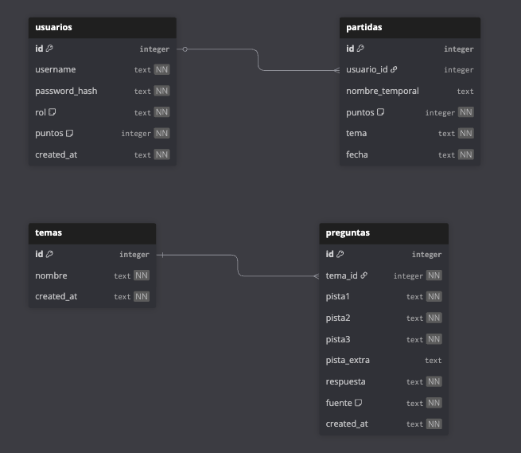

# CLICKA - Juego de Pistas

CLICKA es una aplicacion web de preguntas por pistas.  
El jugador elige una tematica, responde 5 preguntas por partida y suma mas puntos cuanto antes acierta (con menos pistas reveladas).

Incluye ranking global para usuarios registrados, modo especial de banderas y utilidades de siembra de preguntas en SQLite mediante Python.

## Mecanica del juego

- Cada ronda tiene 5 preguntas.
- Cada pregunta muestra pistas progresivas (de dificil a facil).
- Si aciertas con menos pistas, ganas mas puntos.
- Al final se guarda la partida y se actualiza el ranking (si hay sesion iniciada).

## Requisitos

- PHP 8.0+ con extension SQLite3 habilitada
- SQLite3 CLI (`sqlite3`)
- Python 3.10+
- XAMPP o MAMP (o cualquier servidor PHP local)
- (Opcional) IA para generar pistas desde panel admin:
  - Actualmente implementado con `ANTHROPIC_API_KEY` en `api/ai_question.php`
  - Si quereis usar Ollama, hay que adaptar ese endpoint

## Instalacion paso a paso

Desde la raiz del proyecto:

```bash
git clone <URL_DEL_REPO>
cd DAW2-M7-Proyecto-Final-CLICKA-juego-de-Pistas-
```

Inicializar base de datos:

```bash
sqlite3 database/clicka.db < database/schema.sql
sqlite3 database/clicka.db < database/seed.sql
```

Semillas de preguntas (opcional pero recomendado):

```bash
python3 scripts/generator.py --seed scripts/seeds/adivinanzas.json
python3 scripts/generator.py --seed scripts/seeds/ciencia.json
python3 scripts/generator.py --seed scripts/seeds/cultura_popular.json
python3 scripts/generator.py --seed scripts/seeds/historia.json
python3 scripts/generator.py --seed scripts/seeds/geografia.json
python3 scripts/generator.py --seed scripts/seeds/deportes.json
python3 scripts/generator.py --seed scripts/seeds/arte.json
python3 scripts/generator.py --seed scripts/seeds/musica.json
python3 scripts/generator.py --seed scripts/seeds/tecnologia.json
python3 scripts/generator.py --seed scripts/seeds/naturaleza.json
python3 scripts/generator.py --seed scripts/seeds/catalan_basico.json
```

Dependencias Python:

- `scripts/generator.py` usa solo librerias estandar (no requiere `pip install`).

Arrancar servidor PHP:

- Opcion A (XAMPP/MAMP): apuntar DocumentRoot a la carpeta del proyecto.
- Opcion B (PHP built-in):

```bash
php -S localhost:8000
```

Abrir en navegador:

- Si usas XAMPP/MAMP: `http://localhost/<carpeta-del-proyecto>`
- Si usas built-in server: `http://localhost:8000`

## Credenciales de prueba

- `admin / admin123` (admin)
- `jugador / jugador123` (jugador)
- Compatibilidad historica: `admin@gmail.com / admin123`

## Arquitectura (resumen)

```text
Navegador (HTML/CSS/JS)
        |
        v
Pages PHP (pages/*.php)
        |
        +--> API PHP (api/*.php) ----------------------+
        |                                              |
        v                                              v
Sesion PHP (auth)                              SQLite (database/clicka.db)
        ^                                              ^
        |                                              |
Processes (login/register/delete)              Scripts Python (generator.py + seeds/*.json)
```

## Wireframes (Penpot)

- Sustituir este enlace por el proyecto real del equipo:
  - [Penpot wireframes de CLIKA](https://penpot.app/)

## Evidencias visuales y documentación técnica

### Diagrama de base de datos (actual)

- Ruta: `assets/images/diagrama_de_tabla_relacional.png`
- Se recomienda revisar este diagrama junto a `database/schema.sql` antes de la demo.



### Capturas de funcionamiento API

Rutas disponibles:

- `assets/images/screenshot/validate_respuesta_correcta.png`
- `assets/images/screenshot/validate_respuesta_incorrecta.png`
- `assets/images/screenshot/validate_pregunta_no_existe.png`
- `assets/images/screenshot/validate_pistas_usadas_invalido.png`
- `assets/images/screenshot/validate_JSON_invalido.png`
- `assets/images/screenshot/validate_metodo_incorrecto.png`
- `assets/images/screenshot/rounds.png`
- `assets/images/screenshot/rounds_guardar_partida_invitado.png`

Analisis de vigencia con el estado actual del proyecto:

- Las capturas de `validate_*` siguen siendo validas para `api/validate.php` (400, 404, 405 y 500).
- Las capturas de `rounds*` se pueden mantener como evidencia funcional, pero conviene regenerarlas si se quiere reflejar exactamente los cambios recientes de ranking y guardado de partidas.

### Capturas de errores HTTP del frontend

Rutas disponibles:

- `assets/images/errors/error_400.png`
- `assets/images/errors/error_401.png`
- `assets/images/errors/error_403.png`
- `assets/images/errors/error_404.png`
- `assets/images/errors/error_500.png`

Estas imagenes se utilizan en `error.php` para renderizar la pantalla de error segun el codigo HTTP (`?code=400`, `?code=401`, etc.).

## Notas para el repo

- Versionar `database/schema.sql` y `database/seed.sql`.
- No versionar ficheros runtime de SQLite (`*.db`, `*.db-wal`, `*.db-shm`).
